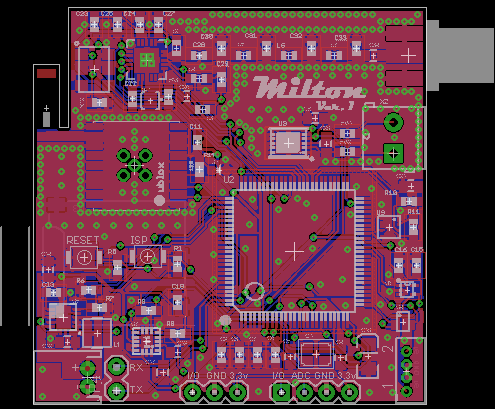

# Milton

LPC1768-based platform for high altitude balloons.

###Hardware

Includes:
* ublox MAX7 GPS
* Bosch BME280 Pressure/Humidity/Temperature Sensor
* Si4464 RF IC to transmit position via APRS
* Capability to trigger 2 Canon cameras loaded with CHDK
* MMA8452Q Accelerometer
* Supports a thermocouple for exterior temperature reading via a OneWire MAX31850

###Software###

*Overview of software functions*
* Beacon position and temps over APRS in a configurable amount of time
* Log GPS position info in GPX format on SD card
* Log sensor info with date/time and gps position on SD card
* Trigger up to 2 cameras on set intervals
* Detect apogee via accelermeter triggering intrrupt. Then trigger cameras and log gps at time of apogee

Hardware is licensed under a <a rel="license" href="http://creativecommons.org/licenses/by-sa/4.0/">Creative Commons Attribution-ShareAlike 4.0 International License</a>.
